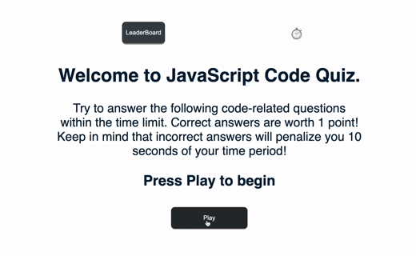

# javascript-code-quiz

[live link](https://sayamgautam1.github.io/javascript-code-quiz/)

# Description

This task is an example of a typical coding assesment included as a part of an interview process. It represents a simple coding assesment which includes multiple-choice questions.

# Purpose

AS A coding boot camp student  
I WANT to take a timed quiz on JavaScript fundamentals that stores high scores  
SO THAT I can gauge my progress compared to my peers  

# Features

When clicked on the start button , the quiz begins  
The timer starts and the first question is presented  
When a question is answered , the result is displayed and next quesiton is displayed  
If a question is answered incorrectly , 10 secs is deducted from your countdown  
Quiz ends when all question is answered or the timer ends  
When game is over the user can save their initials and score  

# Built with

HTML  
CSS  
JavaScript  
JQuery  
